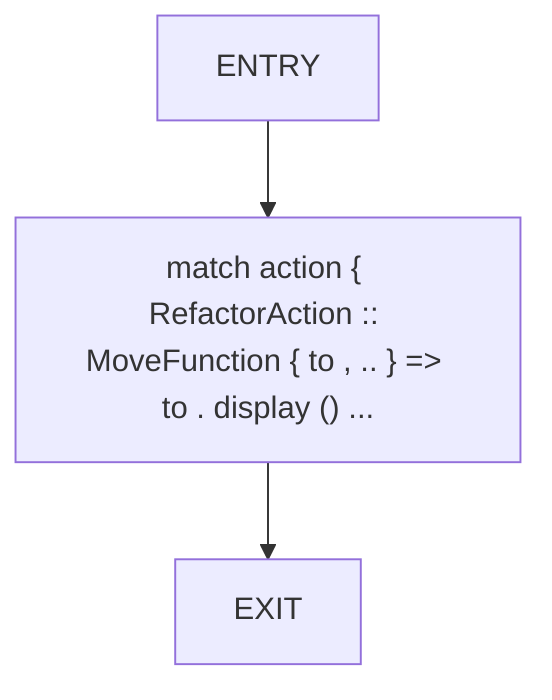
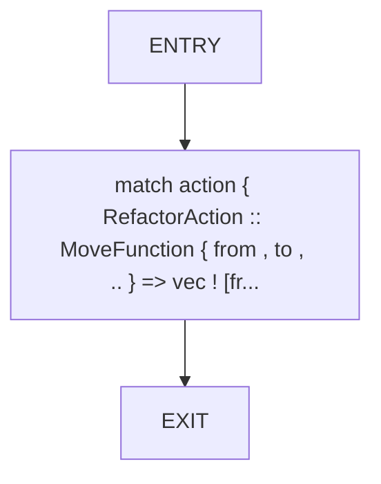
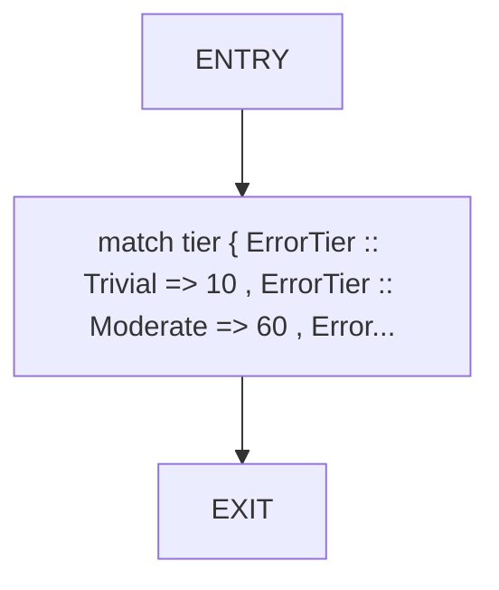
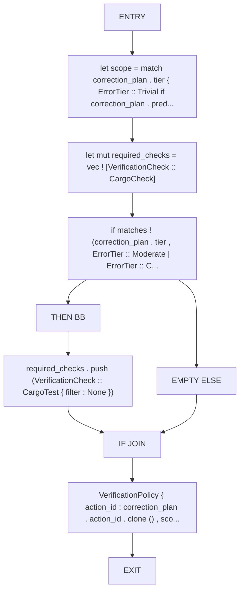

# CFG Group: src/570_verification_scope_planner.rs

## Function: `action_module`

- File: src/570_verification_scope_planner.rs
- Branches: 0
- Loops: 0
- Nodes: 3
- Edges: 2

## Function: `affected_files`

- File: src/570_verification_scope_planner.rs
- Branches: 0
- Loops: 0
- Nodes: 3
- Edges: 2

## Function: `estimate_verification_time`

- File: src/570_verification_scope_planner.rs
- Branches: 0
- Loops: 0
- Nodes: 3
- Edges: 2

## Function: `plan_verification_scope`

- File: src/570_verification_scope_planner.rs
- Branches: 1
- Loops: 0
- Nodes: 10
- Edges: 10

