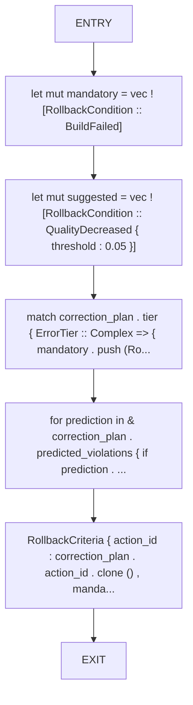
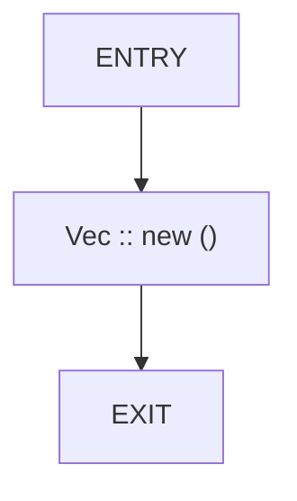

# CFG Group: src/580_rollback_criteria_builder.rs

## Function: `build_rollback_criteria`

- File: src/580_rollback_criteria_builder.rs
- Branches: 0
- Loops: 0
- Nodes: 7
- Edges: 6

## Function: `extract_critical_tests`

- File: src/580_rollback_criteria_builder.rs
- Branches: 0
- Loops: 0
- Nodes: 3
- Edges: 2

