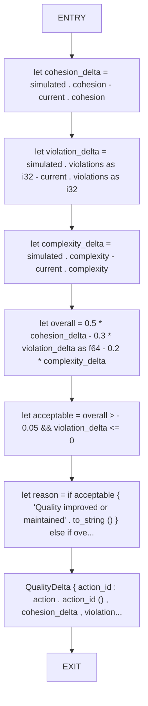
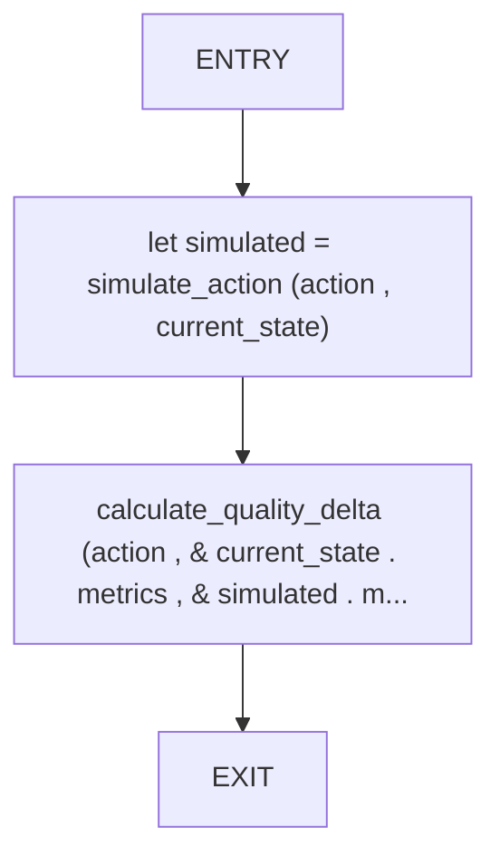

# CFG Group: src/590_quality_delta_calculator.rs

## Function: `calculate_quality_delta`

- File: src/590_quality_delta_calculator.rs
- Branches: 0
- Loops: 0
- Nodes: 9
- Edges: 8

## Function: `estimate_impact`

- File: src/590_quality_delta_calculator.rs
- Branches: 0
- Loops: 0
- Nodes: 4
- Edges: 3

