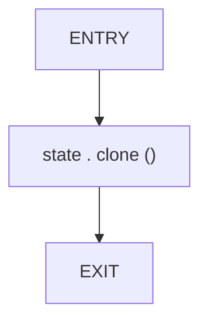

# CFG Group: src/600_action_impact_estimator.rs

## Function: `simulate_action`

- File: src/600_action_impact_estimator.rs
- Branches: 0
- Loops: 0
- Nodes: 3
- Edges: 2

```mermaid
flowchart TD
    simulate_action_0["ENTRY"]
    simulate_action_1["state . clone ()"]
    simulate_action_2["EXIT"]
    simulate_action_0 --> simulate_action_1
    simulate_action_1 --> simulate_action_2
```

