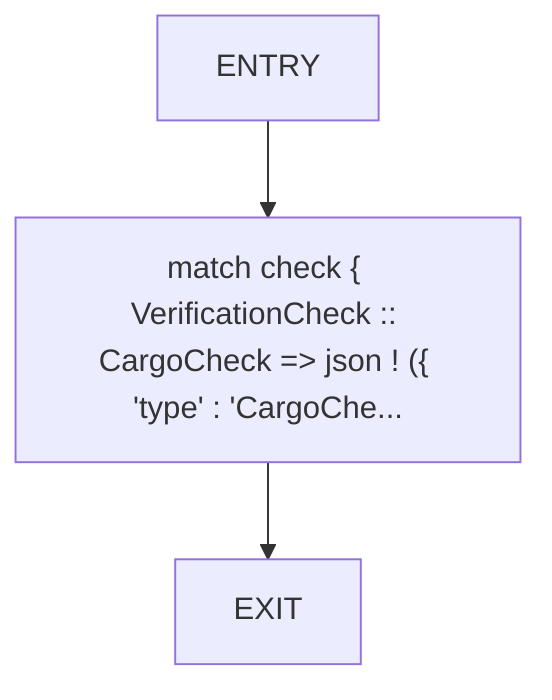
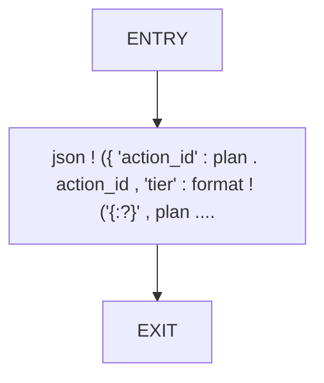
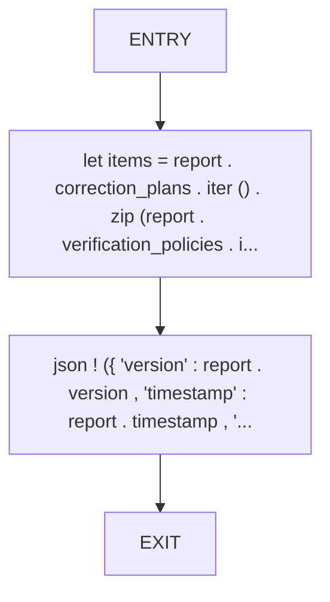
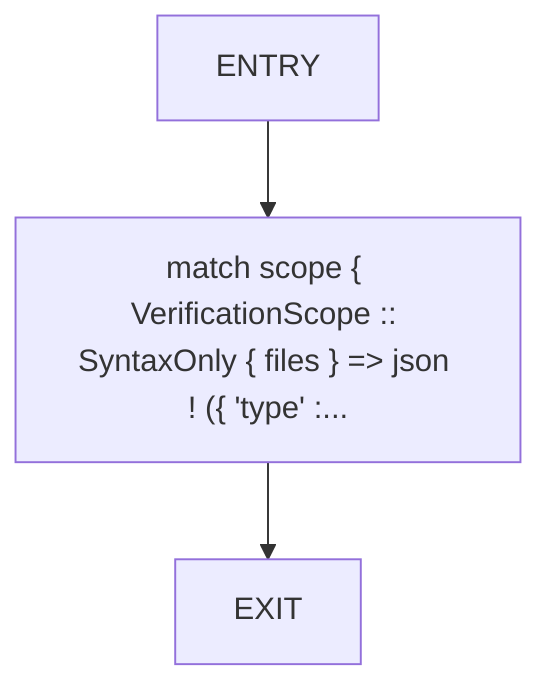
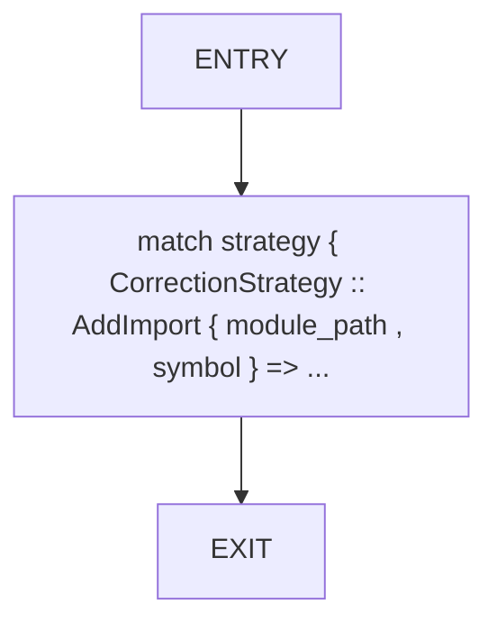
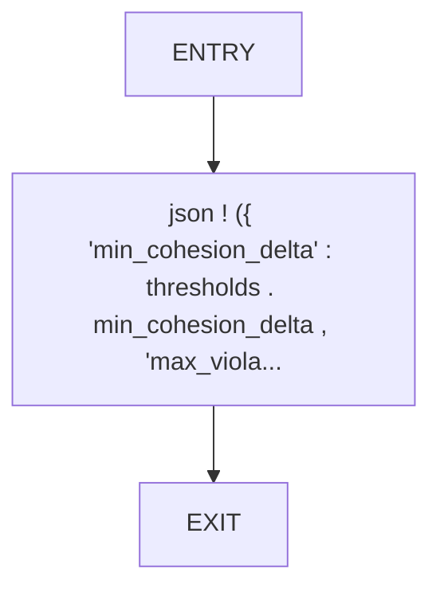

# CFG Group: src/610_correction_plan_serializer.rs

## Function: `serialize_check`

- File: src/610_correction_plan_serializer.rs
- Branches: 0
- Loops: 0
- Nodes: 3
- Edges: 2

## Function: `serialize_correction_plan`

- File: src/610_correction_plan_serializer.rs
- Branches: 0
- Loops: 0
- Nodes: 3
- Edges: 2

## Function: `serialize_correction_plans`

- File: src/610_correction_plan_serializer.rs
- Branches: 0
- Loops: 0
- Nodes: 4
- Edges: 3

## Function: `serialize_scope`

- File: src/610_correction_plan_serializer.rs
- Branches: 0
- Loops: 0
- Nodes: 3
- Edges: 2

## Function: `serialize_strategy`

- File: src/610_correction_plan_serializer.rs
- Branches: 0
- Loops: 0
- Nodes: 3
- Edges: 2

## Function: `serialize_thresholds`

- File: src/610_correction_plan_serializer.rs
- Branches: 0
- Loops: 0
- Nodes: 3
- Edges: 2

## Function: `write_intelligence_outputs_at`

- File: src/610_correction_plan_serializer.rs
- Branches: 2
- Loops: 0
- Nodes: 19
- Edges: 20

```mermaid
flowchart TD
    write_intelligence_outputs_at_0["ENTRY"]
    write_intelligence_outputs_at_1["std :: fs :: create_dir_all (output_dir) ?"]
    write_intelligence_outputs_at_2["let json_path = correction_json . map (| p | p . to_path_buf ()) . unwrap_or_else (| | output..."]
    write_intelligence_outputs_at_3["if let Some (parent) = json_path . parent ()"]
    write_intelligence_outputs_at_4["THEN BB"]
    write_intelligence_outputs_at_5["std :: fs :: create_dir_all (parent) ?"]
    write_intelligence_outputs_at_6["EMPTY ELSE"]
    write_intelligence_outputs_at_7["IF JOIN"]
    write_intelligence_outputs_at_8["let contract = serialize_correction_plans (report)"]
    write_intelligence_outputs_at_9["std :: fs :: write (& json_path , serde_json :: to_string_pretty (& contract)..."]
    write_intelligence_outputs_at_10["let policy_path = verification_policy_json . map (| p | p . to_path_buf ()) . unwrap_or_else (|..."]
    write_intelligence_outputs_at_11["if let Some (parent) = policy_path . parent ()"]
    write_intelligence_outputs_at_12["THEN BB"]
    write_intelligence_outputs_at_13["std :: fs :: create_dir_all (parent) ?"]
    write_intelligence_outputs_at_14["EMPTY ELSE"]
    write_intelligence_outputs_at_15["IF JOIN"]
    write_intelligence_outputs_at_16["emit_verification_policy (& report . verification_policies , & policy_path) ?"]
    write_intelligence_outputs_at_17["Ok (())"]
    write_intelligence_outputs_at_18["EXIT"]
    write_intelligence_outputs_at_0 --> write_intelligence_outputs_at_1
    write_intelligence_outputs_at_1 --> write_intelligence_outputs_at_2
    write_intelligence_outputs_at_2 --> write_intelligence_outputs_at_3
    write_intelligence_outputs_at_3 --> write_intelligence_outputs_at_4
    write_intelligence_outputs_at_4 --> write_intelligence_outputs_at_5
    write_intelligence_outputs_at_3 --> write_intelligence_outputs_at_6
    write_intelligence_outputs_at_5 --> write_intelligence_outputs_at_7
    write_intelligence_outputs_at_6 --> write_intelligence_outputs_at_7
    write_intelligence_outputs_at_7 --> write_intelligence_outputs_at_8
    write_intelligence_outputs_at_8 --> write_intelligence_outputs_at_9
    write_intelligence_outputs_at_9 --> write_intelligence_outputs_at_10
    write_intelligence_outputs_at_10 --> write_intelligence_outputs_at_11
    write_intelligence_outputs_at_11 --> write_intelligence_outputs_at_12
    write_intelligence_outputs_at_12 --> write_intelligence_outputs_at_13
    write_intelligence_outputs_at_11 --> write_intelligence_outputs_at_14
    write_intelligence_outputs_at_13 --> write_intelligence_outputs_at_15
    write_intelligence_outputs_at_14 --> write_intelligence_outputs_at_15
    write_intelligence_outputs_at_15 --> write_intelligence_outputs_at_16
    write_intelligence_outputs_at_16 --> write_intelligence_outputs_at_17
    write_intelligence_outputs_at_17 --> write_intelligence_outputs_at_18
```

