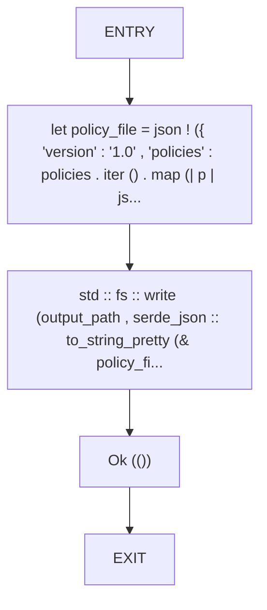
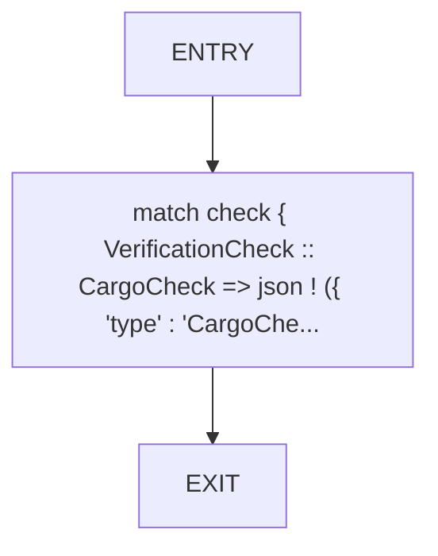
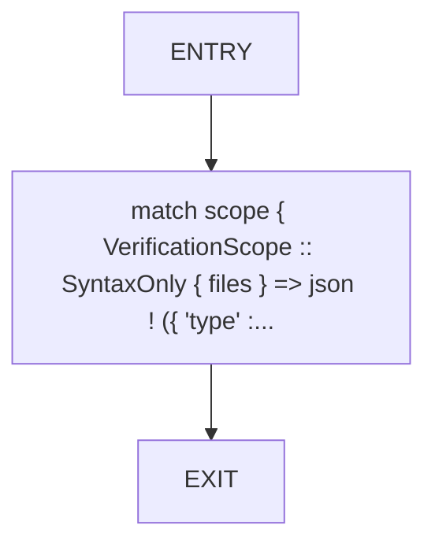
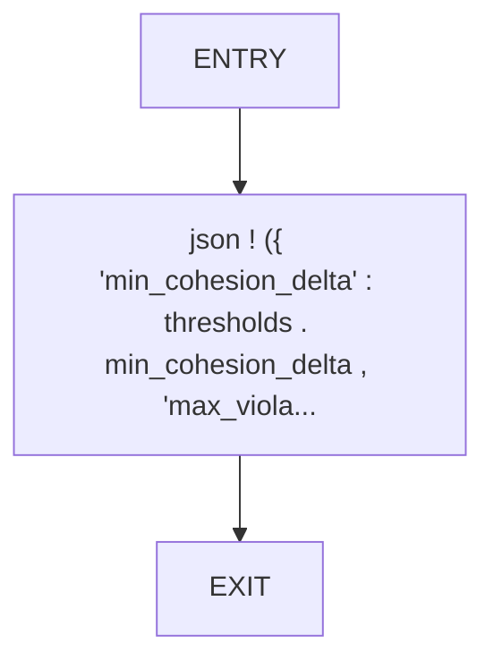

# CFG Group: src/620_verification_policy_emitter.rs

## Function: `emit_verification_policy`

- File: src/620_verification_policy_emitter.rs
- Branches: 0
- Loops: 0
- Nodes: 5
- Edges: 4

## Function: `serialize_check`

- File: src/620_verification_policy_emitter.rs
- Branches: 0
- Loops: 0
- Nodes: 3
- Edges: 2

## Function: `serialize_scope`

- File: src/620_verification_policy_emitter.rs
- Branches: 0
- Loops: 0
- Nodes: 3
- Edges: 2

## Function: `serialize_thresholds`

- File: src/620_verification_policy_emitter.rs
- Branches: 0
- Loops: 0
- Nodes: 3
- Edges: 2

