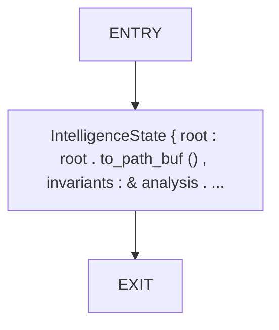
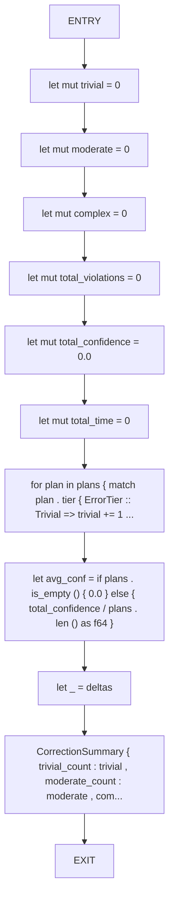
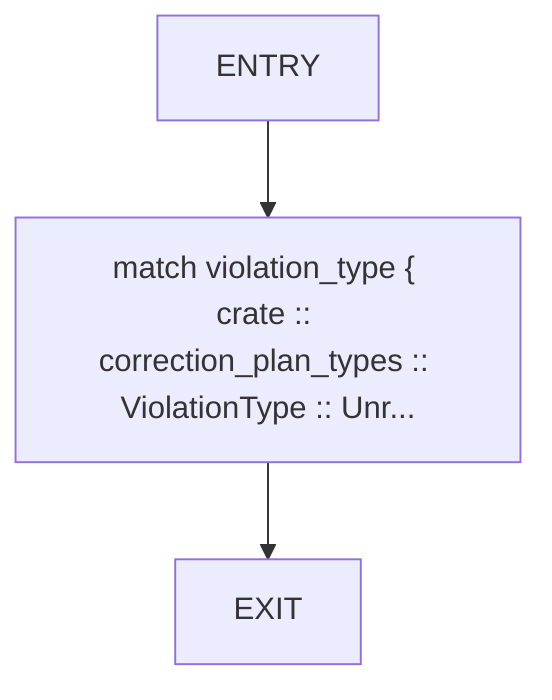
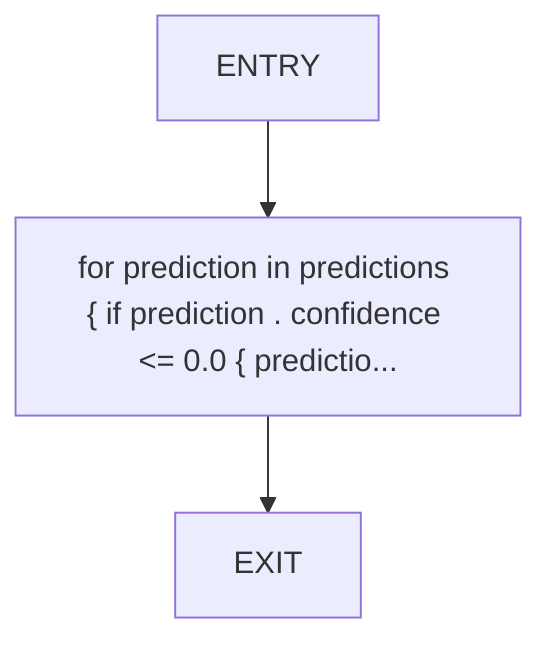
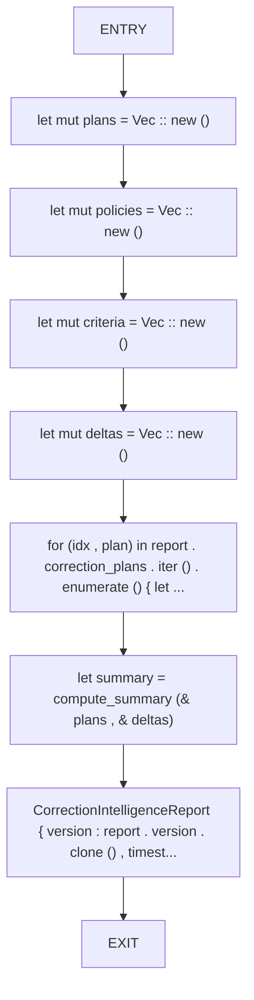
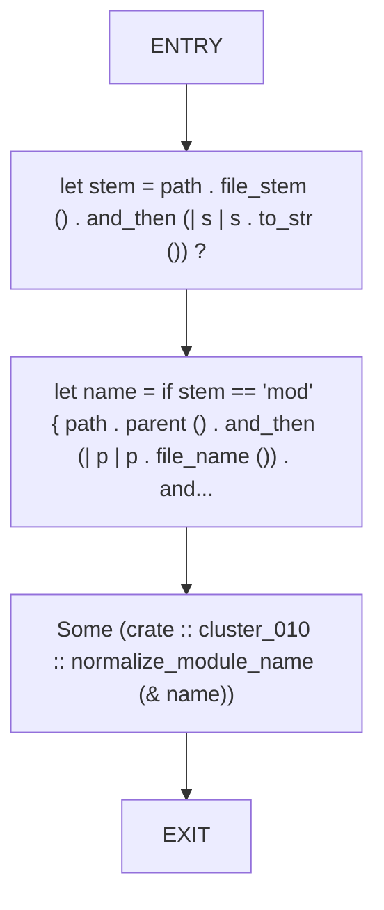
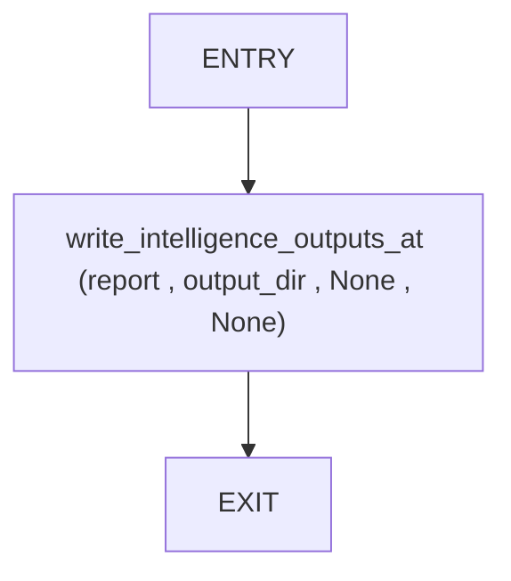

# CFG Group: src/630_correction_intelligence_report.rs

## Function: `augment_path_coherence_strategies`

- File: src/630_correction_intelligence_report.rs
- Branches: 0
- Loops: 0
- Nodes: 17
- Edges: 16

```mermaid
flowchart TD
    augment_path_coherence_strategies_0["ENTRY"]
    augment_path_coherence_strategies_1["let RefactorAction :: RenameFile { from , to } = action else { return ; }"]
    augment_path_coherence_strategies_2["let Some (old_mod) = module_name_from_path (from) else { return ; }"]
    augment_path_coherence_strategies_3["let Some (new_mod) = module_name_from_path (to) else { return ; }"]
    augment_path_coherence_strategies_4["let old_file_name = from . file_name () . and_then (| s | s . to_str ()) . unwrap_or ('')"]
    augment_path_coherence_strategies_5["let new_file_name = to . file_name () . and_then (| s | s . to_str ()) . unwrap_or ('')"]
    augment_path_coherence_strategies_6["let replace_mod = old_mod != new_mod"]
    augment_path_coherence_strategies_7["let mod_re = if replace_mod { Regex :: new (& format ! (r'^\s*(pub\s+)?mod\s+{}\s*;' , reg..."]
    augment_path_coherence_strategies_8["let use_re = if replace_mod { Regex :: new (& format ! (r'^\s*use\s+.*\b{}\b' , regex :: e..."]
    augment_path_coherence_strategies_9["let path_re = if ! old_file_name . is_empty () && ! new_file_name . is_empty () { Regex :: ..."]
    augment_path_coherence_strategies_10["let mut updates = Vec :: new ()"]
    augment_path_coherence_strategies_11["let mut seen = HashSet :: new ()"]
    augment_path_coherence_strategies_12["let rust_files = crate :: cluster_010 :: gather_rust_files (root)"]
    augment_path_coherence_strategies_13["for file in rust_files { let Ok (contents) = fs :: read_to_string (& file) el..."]
    augment_path_coherence_strategies_14["updates . sort_by (| a , b | { a . 0 . cmp (& b . 0) . then_with (| | a . 1 ...."]
    augment_path_coherence_strategies_15["for (file , old_ref , new_ref) in updates { plan . strategies . push (Correct..."]
    augment_path_coherence_strategies_16["EXIT"]
    augment_path_coherence_strategies_0 --> augment_path_coherence_strategies_1
    augment_path_coherence_strategies_1 --> augment_path_coherence_strategies_2
    augment_path_coherence_strategies_2 --> augment_path_coherence_strategies_3
    augment_path_coherence_strategies_3 --> augment_path_coherence_strategies_4
    augment_path_coherence_strategies_4 --> augment_path_coherence_strategies_5
    augment_path_coherence_strategies_5 --> augment_path_coherence_strategies_6
    augment_path_coherence_strategies_6 --> augment_path_coherence_strategies_7
    augment_path_coherence_strategies_7 --> augment_path_coherence_strategies_8
    augment_path_coherence_strategies_8 --> augment_path_coherence_strategies_9
    augment_path_coherence_strategies_9 --> augment_path_coherence_strategies_10
    augment_path_coherence_strategies_10 --> augment_path_coherence_strategies_11
    augment_path_coherence_strategies_11 --> augment_path_coherence_strategies_12
    augment_path_coherence_strategies_12 --> augment_path_coherence_strategies_13
    augment_path_coherence_strategies_13 --> augment_path_coherence_strategies_14
    augment_path_coherence_strategies_14 --> augment_path_coherence_strategies_15
    augment_path_coherence_strategies_15 --> augment_path_coherence_strategies_16
```

## Function: `build_state`

- File: src/630_correction_intelligence_report.rs
- Branches: 0
- Loops: 0
- Nodes: 3
- Edges: 2

## Function: `compute_summary`

- File: src/630_correction_intelligence_report.rs
- Branches: 0
- Loops: 0
- Nodes: 12
- Edges: 11

## Function: `default_confidence`

- File: src/630_correction_intelligence_report.rs
- Branches: 0
- Loops: 0
- Nodes: 3
- Edges: 2

## Function: `fill_prediction_confidence`

- File: src/630_correction_intelligence_report.rs
- Branches: 0
- Loops: 0
- Nodes: 3
- Edges: 2

## Function: `filter_path_coherence_report`

- File: src/630_correction_intelligence_report.rs
- Branches: 0
- Loops: 0
- Nodes: 9
- Edges: 8

## Function: `filter_visibility_report`

- File: src/630_correction_intelligence_report.rs
- Branches: 0
- Loops: 0
- Nodes: 9
- Edges: 8

## Function: `module_name_from_path`

- File: src/630_correction_intelligence_report.rs
- Branches: 0
- Loops: 0
- Nodes: 5
- Edges: 4

## Function: `write_intelligence_outputs`

- File: src/630_correction_intelligence_report.rs
- Branches: 0
- Loops: 0
- Nodes: 3
- Edges: 2

