# Directory: MMSB/tools/mmsb-analyzer/src

- Layer: `root`

## Files

| File | Suggested | Rename |
| --- | --- | --- |
| `MMSB/tools/mmsb-analyzer/src/000_cluster_001.rs` | `000_cluster_001.rs` | no |
| `MMSB/tools/mmsb-analyzer/src/000_main.jl` | `010_main.jl` | yes |
| `MMSB/tools/mmsb-analyzer/src/010_MMSBAnalyzerJulia.jl` | `020_MMSBAnalyzerJulia.jl` | yes |
| `MMSB/tools/mmsb-analyzer/src/010_cluster_008.rs` | `030_cluster_008.rs` | yes |
| `MMSB/tools/mmsb-analyzer/src/020_ast_cfg.jl` | `040_ast_cfg.jl` | yes |
| `MMSB/tools/mmsb-analyzer/src/020_cluster_010.rs` | `050_cluster_010.rs` | yes |
| `MMSB/tools/mmsb-analyzer/src/020_invariant_types.rs` | `060_invariant_types.rs` | yes |
| `MMSB/tools/mmsb-analyzer/src/030_ir_ssa.jl` | `070_ir_ssa.jl` | yes |
| `MMSB/tools/mmsb-analyzer/src/030_refactor_constraints.rs` | `080_refactor_constraints.rs` | yes |
| `MMSB/tools/mmsb-analyzer/src/040_build_model.jl` | `090_build_model.jl` | yes |
| `MMSB/tools/mmsb-analyzer/src/040_scc_compressor.rs` | `100_scc_compressor.rs` | yes |
| `MMSB/tools/mmsb-analyzer/src/050_cluster_010.rs` | `110_cluster_010.rs` | yes |
| `MMSB/tools/mmsb-analyzer/src/060_layer_inference.rs` | `120_layer_inference.rs` | yes |
| `MMSB/tools/mmsb-analyzer/src/070_cluster_011.rs` | `130_cluster_011.rs` | yes |
| `MMSB/tools/mmsb-analyzer/src/080_fixpoint_solver.rs` | `140_fixpoint_solver.rs` | yes |
| `MMSB/tools/mmsb-analyzer/src/090_dependency.rs` | `150_dependency.rs` | yes |
| `MMSB/tools/mmsb-analyzer/src/100_structural_detector.rs` | `160_structural_detector.rs` | yes |
| `MMSB/tools/mmsb-analyzer/src/110_cluster_006.rs` | `170_cluster_006.rs` | yes |
| `MMSB/tools/mmsb-analyzer/src/120_semantic_detector.rs` | `180_semantic_detector.rs` | yes |
| `MMSB/tools/mmsb-analyzer/src/130_layer_core.rs` | `190_layer_core.rs` | yes |
| `MMSB/tools/mmsb-analyzer/src/140_path_detector.rs` | `200_path_detector.rs` | yes |
| `MMSB/tools/mmsb-analyzer/src/150_invariant_integrator.rs` | `210_invariant_integrator.rs` | yes |
| `MMSB/tools/mmsb-analyzer/src/160_layer_utilities.rs` | `220_layer_utilities.rs` | yes |
| `MMSB/tools/mmsb-analyzer/src/170_invariant_reporter.rs` | `230_invariant_reporter.rs` | yes |
| `MMSB/tools/mmsb-analyzer/src/180_conscience_graph.rs` | `240_conscience_graph.rs` | yes |
| `MMSB/tools/mmsb-analyzer/src/190_action_validator.rs` | `250_action_validator.rs` | yes |
| `MMSB/tools/mmsb-analyzer/src/200_agent_conscience.rs` | `260_agent_conscience.rs` | yes |
| `MMSB/tools/mmsb-analyzer/src/210_utilities.rs` | `270_utilities.rs` | yes |
| `MMSB/tools/mmsb-analyzer/src/211_dead_code_attribute_parser.rs` | `280_dead_code_attribute_parser.rs` | yes |
| `MMSB/tools/mmsb-analyzer/src/220_types.rs` | `290_types.rs` | yes |
| `MMSB/tools/mmsb-analyzer/src/230_cohesion_analyzer.rs` | `300_cohesion_analyzer.rs` | yes |
| `MMSB/tools/mmsb-analyzer/src/240_directory_analyzer.rs` | `310_directory_analyzer.rs` | yes |
| `MMSB/tools/mmsb-analyzer/src/250_control_flow.rs` | `320_control_flow.rs` | yes |
| `MMSB/tools/mmsb-analyzer/src/260_file_ordering.rs` | `330_file_ordering.rs` | yes |
| `MMSB/tools/mmsb-analyzer/src/270_julia_parser.rs` | `340_julia_parser.rs` | yes |
| `MMSB/tools/mmsb-analyzer/src/280_rust_parser.rs` | `350_rust_parser.rs` | yes |
| `MMSB/tools/mmsb-analyzer/src/290_dot_exporter.rs` | `360_dot_exporter.rs` | yes |
| `MMSB/tools/mmsb-analyzer/src/300_file_gathering.rs` | `370_file_gathering.rs` | yes |
| `MMSB/tools/mmsb-analyzer/src/310_report.rs` | `380_report.rs` | yes |
| `MMSB/tools/mmsb-analyzer/src/320_main.rs` | `390_main.rs` | yes |
| `MMSB/tools/mmsb-analyzer/src/330_agent_cli.rs` | `400_agent_cli.rs` | yes |
| `MMSB/tools/mmsb-analyzer/src/340_lib.rs` | `410_lib.rs` | yes |
| `MMSB/tools/mmsb-analyzer/src/350_dead_code_types.rs` | `420_dead_code_types.rs` | yes |
| `MMSB/tools/mmsb-analyzer/src/370_dead_code_doc_comment_parser.rs` | `430_dead_code_doc_comment_parser.rs` | yes |
| `MMSB/tools/mmsb-analyzer/src/380_dead_code_call_graph.rs` | `440_dead_code_call_graph.rs` | yes |
| `MMSB/tools/mmsb-analyzer/src/390_dead_code_intent.rs` | `450_dead_code_intent.rs` | yes |
| `MMSB/tools/mmsb-analyzer/src/400_dead_code_test_boundaries.rs` | `460_dead_code_test_boundaries.rs` | yes |
| `MMSB/tools/mmsb-analyzer/src/410_dead_code_entrypoints.rs` | `470_dead_code_entrypoints.rs` | yes |
| `MMSB/tools/mmsb-analyzer/src/420_dead_code_classifier.rs` | `480_dead_code_classifier.rs` | yes |
| `MMSB/tools/mmsb-analyzer/src/430_dead_code_confidence.rs` | `490_dead_code_confidence.rs` | yes |
| `MMSB/tools/mmsb-analyzer/src/440_dead_code_actions.rs` | `500_dead_code_actions.rs` | yes |
| `MMSB/tools/mmsb-analyzer/src/450_correction_plan_types.rs` | `510_correction_plan_types.rs` | yes |
| `MMSB/tools/mmsb-analyzer/src/460_dead_code_report.rs` | `520_dead_code_report.rs` | yes |
| `MMSB/tools/mmsb-analyzer/src/470_dead_code_filter.rs` | `530_dead_code_filter.rs` | yes |
| `MMSB/tools/mmsb-analyzer/src/480_verification_policy_types.rs` | `540_verification_policy_types.rs` | yes |
| `MMSB/tools/mmsb-analyzer/src/490_dead_code_cli.rs` | `550_dead_code_cli.rs` | yes |
| `MMSB/tools/mmsb-analyzer/src/500_quality_delta_types.rs` | `560_quality_delta_types.rs` | yes |
| `MMSB/tools/mmsb-analyzer/src/510_dead_code_policy.rs` | `570_dead_code_policy.rs` | yes |
| `MMSB/tools/mmsb-analyzer/src/520_violation_predictor.rs` | `580_violation_predictor.rs` | yes |
| `MMSB/tools/mmsb-analyzer/src/530_dead_code_report_split.rs` | `590_dead_code_report_split.rs` | yes |
| `MMSB/tools/mmsb-analyzer/src/540_tier_classifier.rs` | `600_tier_classifier.rs` | yes |
| `MMSB/tools/mmsb-analyzer/src/550_confidence_scorer.rs` | `610_confidence_scorer.rs` | yes |
| `MMSB/tools/mmsb-analyzer/src/560_correction_plan_generator.rs` | `620_correction_plan_generator.rs` | yes |
| `MMSB/tools/mmsb-analyzer/src/570_verification_scope_planner.rs` | `630_verification_scope_planner.rs` | yes |
| `MMSB/tools/mmsb-analyzer/src/580_rollback_criteria_builder.rs` | `640_rollback_criteria_builder.rs` | yes |
| `MMSB/tools/mmsb-analyzer/src/590_quality_delta_calculator.rs` | `650_quality_delta_calculator.rs` | yes |
| `MMSB/tools/mmsb-analyzer/src/600_action_impact_estimator.rs` | `660_action_impact_estimator.rs` | yes |
| `MMSB/tools/mmsb-analyzer/src/610_correction_plan_serializer.rs` | `670_correction_plan_serializer.rs` | yes |
| `MMSB/tools/mmsb-analyzer/src/620_verification_policy_emitter.rs` | `680_verification_policy_emitter.rs` | yes |
| `MMSB/tools/mmsb-analyzer/src/630_correction_intelligence_report.rs` | `690_correction_intelligence_report.rs` | yes |

## Dependency Graph

```mermaid
graph TD
    F0["000_cluster_001.rs"]
    F1["000_main.jl"]
    F2["010_MMSBAnalyzerJulia.jl"]
    F3["010_cluster_008.rs"]
    F4["020_ast_cfg.jl"]
    F5["020_cluster_010.rs"]
    F6["020_invariant_types.rs"]
    F7["030_ir_ssa.jl"]
    F8["030_refactor_constraints.rs"]
    F9["040_build_model.jl"]
    F10["040_scc_compressor.rs"]
    F11["050_cluster_010.rs"]
    F12["060_layer_inference.rs"]
    F13["070_cluster_011.rs"]
    F14["080_fixpoint_solver.rs"]
    F15["090_dependency.rs"]
    F16["100_structural_detector.rs"]
    F17["110_cluster_006.rs"]
    F18["120_semantic_detector.rs"]
    F19["130_layer_core.rs"]
    F20["140_path_detector.rs"]
    F21["150_invariant_integrator.rs"]
    F22["160_layer_utilities.rs"]
    F23["170_invariant_reporter.rs"]
    F24["180_conscience_graph.rs"]
    F25["190_action_validator.rs"]
    F26["200_agent_conscience.rs"]
    F27["210_utilities.rs"]
    F28["211_dead_code_attribute_parser.rs"]
    F29["220_types.rs"]
    F30["230_cohesion_analyzer.rs"]
    F31["240_directory_analyzer.rs"]
    F32["250_control_flow.rs"]
    F33["260_file_ordering.rs"]
    F34["270_julia_parser.rs"]
    F35["280_rust_parser.rs"]
    F36["290_dot_exporter.rs"]
    F37["300_file_gathering.rs"]
    F38["310_report.rs"]
    F39["320_main.rs"]
    F40["330_agent_cli.rs"]
    F41["340_lib.rs"]
    F42["350_dead_code_types.rs"]
    F43["370_dead_code_doc_comment_parser.rs"]
    F44["380_dead_code_call_graph.rs"]
    F45["390_dead_code_intent.rs"]
    F46["400_dead_code_test_boundaries.rs"]
    F47["410_dead_code_entrypoints.rs"]
    F48["420_dead_code_classifier.rs"]
    F49["430_dead_code_confidence.rs"]
    F50["440_dead_code_actions.rs"]
    F51["450_correction_plan_types.rs"]
    F52["460_dead_code_report.rs"]
    F53["470_dead_code_filter.rs"]
    F54["480_verification_policy_types.rs"]
    F55["490_dead_code_cli.rs"]
    F56["500_quality_delta_types.rs"]
    F57["510_dead_code_policy.rs"]
    F58["520_violation_predictor.rs"]
    F59["530_dead_code_report_split.rs"]
    F60["540_tier_classifier.rs"]
    F61["550_confidence_scorer.rs"]
    F62["560_correction_plan_generator.rs"]
    F63["570_verification_scope_planner.rs"]
    F64["580_rollback_criteria_builder.rs"]
    F65["590_quality_delta_calculator.rs"]
    F66["600_action_impact_estimator.rs"]
    F67["610_correction_plan_serializer.rs"]
    F68["620_verification_policy_emitter.rs"]
    F69["630_correction_intelligence_report.rs"]
    F69 --> F67
    F51 --> F67
    F56 --> F67
    F68 --> F67
    F54 --> F67
    F28 --> F45
    F43 --> F45
    F42 --> F45
    F55 --> F52
    F59 --> F52
    F42 --> F52
    F51 --> F61
    F25 --> F26
    F6 --> F26
    F8 --> F26
    F51 --> F62
    F60 --> F62
    F54 --> F68
    F0 --> F36
    F13 --> F36
    F17 --> F30
    F3 --> F30
    F29 --> F30
    F43 --> F28
    F45 --> F28
    F46 --> F28
    F42 --> F28
    F6 --> F8
    F25 --> F40
    F26 --> F40
    F6 --> F40
    F29 --> F51
    F66 --> F58
    F69 --> F58
    F62 --> F58
    F51 --> F58
    F6 --> F58
    F64 --> F58
    F29 --> F58
    F63 --> F58
    F45 --> F47
    F29 --> F47
    F0 --> F11
    F15 --> F11
    F22 --> F11
    F6 --> F16
    F12 --> F16
    F10 --> F16
    F29 --> F16
    F0 --> F19
    F17 --> F19
    F3 --> F19
    F67 --> F69
    F51 --> F69
    F6 --> F69
    F65 --> F69
    F56 --> F69
    F29 --> F69
    F58 --> F69
    F0 --> F22
    F11 --> F22
    F50 --> F22
    F28 --> F22
    F44 --> F22
    F55 --> F22
    F49 --> F22
    F47 --> F22
    F45 --> F22
    F52 --> F22
    F46 --> F22
    F42 --> F22
    F29 --> F22
    F6 --> F21
    F12 --> F21
    F20 --> F21
    F8 --> F21
    F18 --> F21
    F16 --> F21
    F29 --> F21
    F0 --> F33
    F11 --> F33
    F13 --> F33
    F15 --> F33
    F8 --> F25
    F52 --> F53
    F42 --> F53
    F29 --> F53
    F6 --> F18
    F29 --> F18
    F42 --> F43
    F25 --> F41
    F26 --> F41
    F30 --> F41
    F24 --> F41
    F32 --> F41
    F15 --> F41
    F31 --> F41
    F36 --> F41
    F33 --> F41
    F6 --> F41
    F34 --> F41
    F8 --> F41
    F38 --> F41
    F35 --> F41
    F29 --> F41
    F66 --> F41
    F25 --> F41
    F26 --> F41
    F0 --> F41
    F17 --> F41
    F3 --> F41
    F11 --> F41
    F13 --> F41
    F30 --> F41
    F61 --> F41
    F24 --> F41
    F32 --> F41
    F69 --> F41
    F62 --> F41
    F67 --> F41
    F51 --> F41
    F50 --> F41
    F28 --> F41
    F44 --> F41
    F48 --> F41
    F55 --> F41
    F49 --> F41
    F43 --> F41
    F47 --> F41
    F53 --> F41
    F45 --> F41
    F57 --> F41
    F52 --> F41
    F59 --> F41
    F46 --> F41
    F42 --> F41
    F15 --> F41
    F31 --> F41
    F36 --> F41
    F33 --> F41
    F14 --> F41
    F21 --> F41
    F23 --> F41
    F6 --> F41
    F34 --> F41
    F19 --> F41
    F12 --> F41
    F22 --> F41
    F20 --> F41
    F65 --> F41
    F56 --> F41
    F8 --> F41
    F38 --> F41
    F64 --> F41
    F35 --> F41
    F10 --> F41
    F18 --> F41
    F16 --> F41
    F60 --> F41
    F29 --> F41
    F27 --> F41
    F68 --> F41
    F54 --> F41
    F63 --> F41
    F58 --> F41
    F42 --> F49
    F29 --> F32
    F27 --> F32
    F66 --> F65
    F51 --> F65
    F56 --> F65
    F25 --> F38
    F3 --> F38
    F32 --> F38
    F15 --> F38
    F33 --> F38
    F19 --> F38
    F8 --> F38
    F29 --> F38
    F27 --> F38
    F51 --> F56
    F0 --> F0
    F17 --> F0
    F11 --> F0
    F30 --> F0
    F32 --> F0
    F15 --> F0
    F31 --> F0
    F36 --> F0
    F33 --> F0
    F21 --> F0
    F23 --> F0
    F34 --> F0
    F19 --> F0
    F22 --> F0
    F38 --> F0
    F35 --> F0
    F29 --> F0
    F27 --> F0
    F45 --> F57
    F29 --> F34
    F45 --> F44
    F46 --> F44
    F42 --> F44
    F29 --> F44
    F6 --> F29
    F8 --> F29
    F45 --> F55
    F42 --> F55
    F22 --> F55
    F0 --> F15
    F11 --> F15
    F13 --> F15
    F6 --> F20
    F10 --> F20
    F66 --> F39
    F25 --> F39
    F40 --> F39
    F26 --> F39
    F0 --> F39
    F17 --> F39
    F3 --> F39
    F11 --> F39
    F13 --> F39
    F30 --> F39
    F61 --> F39
    F24 --> F39
    F32 --> F39
    F69 --> F39
    F62 --> F39
    F67 --> F39
    F51 --> F39
    F50 --> F39
    F28 --> F39
    F44 --> F39
    F48 --> F39
    F55 --> F39
    F49 --> F39
    F43 --> F39
    F47 --> F39
    F53 --> F39
    F45 --> F39
    F57 --> F39
    F52 --> F39
    F59 --> F39
    F46 --> F39
    F42 --> F39
    F15 --> F39
    F31 --> F39
    F36 --> F39
    F33 --> F39
    F14 --> F39
    F21 --> F39
    F23 --> F39
    F6 --> F39
    F34 --> F39
    F19 --> F39
    F12 --> F39
    F22 --> F39
    F20 --> F39
    F65 --> F39
    F56 --> F39
    F8 --> F39
    F38 --> F39
    F64 --> F39
    F35 --> F39
    F10 --> F39
    F18 --> F39
    F16 --> F39
    F60 --> F39
    F29 --> F39
    F27 --> F39
    F68 --> F39
    F54 --> F39
    F63 --> F39
    F58 --> F39
    F44 --> F46
    F22 --> F5
    F3 --> F17
    F6 --> F12
    F15 --> F31
    F22 --> F31
    F29 --> F31
    F29 --> F35
    F42 --> F50
    F51 --> F64
    F56 --> F64
    F51 --> F66
    F65 --> F66
    F51 --> F63
    F54 --> F63
    F44 --> F48
    F52 --> F59
    F42 --> F59
    F15 --> F3
    F29 --> F3
    F6 --> F24
    F51 --> F60
    F38 --> F27
    F29 --> F27
    F6 --> F23
    F8 --> F23
    F29 --> F13
```

