# Directory: MMSB/tools/mmsb-analyzer/src

- Layer: `root`

## Files

| File | Suggested | Rename |
| --- | --- | --- |
| `MMSB/tools/mmsb-analyzer/src/000_cluster_001.rs` | `000_cluster_001.rs` | no |
| `MMSB/tools/mmsb-analyzer/src/000_invariant_types.rs` | `010_invariant_types.rs` | yes |
| `MMSB/tools/mmsb-analyzer/src/000_main.jl` | `020_main.jl` | yes |
| `MMSB/tools/mmsb-analyzer/src/005_refactor_constraints.rs` | `030_refactor_constraints.rs` | yes |
| `MMSB/tools/mmsb-analyzer/src/010_MMSBAnalyzerJulia.jl` | `040_MMSBAnalyzerJulia.jl` | yes |
| `MMSB/tools/mmsb-analyzer/src/010_cluster_008.rs` | `050_cluster_008.rs` | yes |
| `MMSB/tools/mmsb-analyzer/src/010_scc_compressor.rs` | `060_scc_compressor.rs` | yes |
| `MMSB/tools/mmsb-analyzer/src/020_ast_cfg.jl` | `070_ast_cfg.jl` | yes |
| `MMSB/tools/mmsb-analyzer/src/020_cluster_010.rs` | `080_cluster_010.rs` | yes |
| `MMSB/tools/mmsb-analyzer/src/020_layer_inference.rs` | `090_layer_inference.rs` | yes |
| `MMSB/tools/mmsb-analyzer/src/030_cluster_011.rs` | `100_cluster_011.rs` | yes |
| `MMSB/tools/mmsb-analyzer/src/030_fixpoint_solver.rs` | `110_fixpoint_solver.rs` | yes |
| `MMSB/tools/mmsb-analyzer/src/030_ir_ssa.jl` | `120_ir_ssa.jl` | yes |
| `MMSB/tools/mmsb-analyzer/src/040_build_model.jl` | `130_build_model.jl` | yes |
| `MMSB/tools/mmsb-analyzer/src/040_dependency.rs` | `140_dependency.rs` | yes |
| `MMSB/tools/mmsb-analyzer/src/040_structural_detector.rs` | `150_structural_detector.rs` | yes |
| `MMSB/tools/mmsb-analyzer/src/050_cluster_006.rs` | `160_cluster_006.rs` | yes |
| `MMSB/tools/mmsb-analyzer/src/050_semantic_detector.rs` | `170_semantic_detector.rs` | yes |
| `MMSB/tools/mmsb-analyzer/src/060_layer_core.rs` | `180_layer_core.rs` | yes |
| `MMSB/tools/mmsb-analyzer/src/060_path_detector.rs` | `190_path_detector.rs` | yes |
| `MMSB/tools/mmsb-analyzer/src/070_invariant_integrator.rs` | `200_invariant_integrator.rs` | yes |
| `MMSB/tools/mmsb-analyzer/src/070_layer_utilities.rs` | `210_layer_utilities.rs` | yes |
| `MMSB/tools/mmsb-analyzer/src/080_file_gathering.rs` | `220_file_gathering.rs` | yes |
| `MMSB/tools/mmsb-analyzer/src/080_invariant_reporter.rs` | `230_invariant_reporter.rs` | yes |
| `MMSB/tools/mmsb-analyzer/src/082_conscience_graph.rs` | `240_conscience_graph.rs` | yes |
| `MMSB/tools/mmsb-analyzer/src/083_action_validator.rs` | `250_action_validator.rs` | yes |
| `MMSB/tools/mmsb-analyzer/src/085_agent_conscience.rs` | `260_agent_conscience.rs` | yes |
| `MMSB/tools/mmsb-analyzer/src/090_utilities.rs` | `270_utilities.rs` | yes |
| `MMSB/tools/mmsb-analyzer/src/100_types.rs` | `280_types.rs` | yes |
| `MMSB/tools/mmsb-analyzer/src/110_cohesion_analyzer.rs` | `290_cohesion_analyzer.rs` | yes |
| `MMSB/tools/mmsb-analyzer/src/120_directory_analyzer.rs` | `300_directory_analyzer.rs` | yes |
| `MMSB/tools/mmsb-analyzer/src/130_control_flow.rs` | `310_control_flow.rs` | yes |
| `MMSB/tools/mmsb-analyzer/src/140_file_ordering.rs` | `320_file_ordering.rs` | yes |
| `MMSB/tools/mmsb-analyzer/src/150_julia_parser.rs` | `330_julia_parser.rs` | yes |
| `MMSB/tools/mmsb-analyzer/src/160_rust_parser.rs` | `340_rust_parser.rs` | yes |
| `MMSB/tools/mmsb-analyzer/src/170_dot_exporter.rs` | `350_dot_exporter.rs` | yes |
| `MMSB/tools/mmsb-analyzer/src/180_report.rs` | `360_report.rs` | yes |
| `MMSB/tools/mmsb-analyzer/src/190_main.rs` | `370_main.rs` | yes |
| `MMSB/tools/mmsb-analyzer/src/191_agent_cli.rs` | `380_agent_cli.rs` | yes |
| `MMSB/tools/mmsb-analyzer/src/200_lib.rs` | `390_lib.rs` | yes |

## Dependency Graph

```mermaid
graph TD
    F0["000_cluster_001.rs"]
    F1["000_invariant_types.rs"]
    F2["000_main.jl"]
    F3["005_refactor_constraints.rs"]
    F4["010_MMSBAnalyzerJulia.jl"]
    F5["010_cluster_008.rs"]
    F6["010_scc_compressor.rs"]
    F7["020_ast_cfg.jl"]
    F8["020_cluster_010.rs"]
    F9["020_layer_inference.rs"]
    F10["030_cluster_011.rs"]
    F11["030_fixpoint_solver.rs"]
    F12["030_ir_ssa.jl"]
    F13["040_build_model.jl"]
    F14["040_dependency.rs"]
    F15["040_structural_detector.rs"]
    F16["050_cluster_006.rs"]
    F17["050_semantic_detector.rs"]
    F18["060_layer_core.rs"]
    F19["060_path_detector.rs"]
    F20["070_invariant_integrator.rs"]
    F21["070_layer_utilities.rs"]
    F22["080_file_gathering.rs"]
    F23["080_invariant_reporter.rs"]
    F24["082_conscience_graph.rs"]
    F25["083_action_validator.rs"]
    F26["085_agent_conscience.rs"]
    F27["090_utilities.rs"]
    F28["100_types.rs"]
    F29["110_cohesion_analyzer.rs"]
    F30["120_directory_analyzer.rs"]
    F31["130_control_flow.rs"]
    F32["140_file_ordering.rs"]
    F33["150_julia_parser.rs"]
    F34["160_rust_parser.rs"]
    F35["170_dot_exporter.rs"]
    F36["180_report.rs"]
    F37["190_main.rs"]
    F38["191_agent_cli.rs"]
    F39["200_lib.rs"]
    F0 --> F18
    F16 --> F18
    F5 --> F18
    F1 --> F28
    F3 --> F28
    F1 --> F24
    F14 --> F30
    F21 --> F30
    F28 --> F30
    F16 --> F0
    F14 --> F0
    F32 --> F0
    F18 --> F0
    F21 --> F0
    F28 --> F0
    F27 --> F0
    F0 --> F14
    F8 --> F14
    F10 --> F14
    F16 --> F29
    F5 --> F29
    F28 --> F29
    F25 --> F26
    F1 --> F26
    F3 --> F26
    F28 --> F34
    F1 --> F9
    F0 --> F35
    F10 --> F35
    F28 --> F31
    F27 --> F31
    F3 --> F25
    F28 --> F33
    F28 --> F10
    F0 --> F32
    F8 --> F32
    F10 --> F32
    F14 --> F32
    F1 --> F3
    F0 --> F21
    F8 --> F21
    F29 --> F21
    F31 --> F21
    F14 --> F21
    F30 --> F21
    F35 --> F21
    F20 --> F21
    F23 --> F21
    F33 --> F21
    F36 --> F21
    F34 --> F21
    F28 --> F21
    F1 --> F15
    F9 --> F15
    F6 --> F15
    F28 --> F15
    F1 --> F20
    F9 --> F20
    F19 --> F20
    F3 --> F20
    F17 --> F20
    F15 --> F20
    F28 --> F20
    F25 --> F36
    F5 --> F36
    F31 --> F36
    F14 --> F36
    F32 --> F36
    F18 --> F36
    F3 --> F36
    F28 --> F36
    F27 --> F36
    F25 --> F37
    F38 --> F37
    F26 --> F37
    F0 --> F37
    F16 --> F37
    F5 --> F37
    F8 --> F37
    F10 --> F37
    F29 --> F37
    F24 --> F37
    F31 --> F37
    F14 --> F37
    F30 --> F37
    F35 --> F37
    F32 --> F37
    F11 --> F37
    F20 --> F37
    F23 --> F37
    F1 --> F37
    F33 --> F37
    F18 --> F37
    F9 --> F37
    F21 --> F37
    F19 --> F37
    F3 --> F37
    F36 --> F37
    F34 --> F37
    F6 --> F37
    F17 --> F37
    F15 --> F37
    F28 --> F37
    F27 --> F37
    F1 --> F23
    F3 --> F23
    F1 --> F17
    F28 --> F17
    F36 --> F27
    F28 --> F27
    F0 --> F8
    F14 --> F8
    F14 --> F5
    F28 --> F5
    F5 --> F16
    F25 --> F38
    F26 --> F38
    F1 --> F38
    F1 --> F19
    F6 --> F19
    F25 --> F39
    F26 --> F39
    F29 --> F39
    F24 --> F39
    F31 --> F39
    F14 --> F39
    F30 --> F39
    F35 --> F39
    F32 --> F39
    F1 --> F39
    F33 --> F39
    F3 --> F39
    F36 --> F39
    F34 --> F39
    F28 --> F39
    F25 --> F39
    F26 --> F39
    F0 --> F39
    F16 --> F39
    F5 --> F39
    F8 --> F39
    F10 --> F39
    F29 --> F39
    F24 --> F39
    F31 --> F39
    F14 --> F39
    F30 --> F39
    F35 --> F39
    F32 --> F39
    F11 --> F39
    F20 --> F39
    F23 --> F39
    F1 --> F39
    F33 --> F39
    F18 --> F39
    F9 --> F39
    F21 --> F39
    F19 --> F39
    F3 --> F39
    F36 --> F39
    F34 --> F39
    F6 --> F39
    F17 --> F39
    F15 --> F39
    F28 --> F39
    F27 --> F39
```

